# Quackverse Canon Art Sheet Plan

This document is the canonical bulk-authoring plan for Quackverse static card art. It does not replace per-card canon in `src/lib/quackverse-canon-groups.ts` or `src/lib/quackverse-visual-canon.ts`; it groups those identities into controlled contact sheets so related characters share visual DNA without becoming clones.

## Production target

- Total cards: **101**
- Character cards: **80**
- Equipment/relic cards: **21**
- Character sheets: **10 x 8-up sheets = 80 characters**
- Gear sheets: **2 x 8-up sheets + 1 x 5-up sheet = 21 relics**
- Total generation calls for one full-deck pass: **13**
- Standard 8-up sheet: **1920x2400**, 2 columns x 4 rows, each crop **960x600 (8:5)**
- Final 5-up gear sheet: **3072x1280**, 3 columns x 2 rows, each crop **1024x640 (8:5)**; slot 6 is intentionally unused.

## Slot order and crop coordinates

All slots are row-major: left-to-right, then top-to-bottom.

### 1920x2400 / 2x4

| Slot | Row | Col | x | y | w | h |
|---:|---:|---:|---:|---:|---:|---:|
| 1 | 1 | 1 | 0 | 0 | 960 | 600 |
| 2 | 1 | 2 | 960 | 0 | 960 | 600 |
| 3 | 2 | 1 | 0 | 600 | 960 | 600 |
| 4 | 2 | 2 | 960 | 600 | 960 | 600 |
| 5 | 3 | 1 | 0 | 1200 | 960 | 600 |
| 6 | 3 | 2 | 960 | 1200 | 960 | 600 |
| 7 | 4 | 1 | 0 | 1800 | 960 | 600 |
| 8 | 4 | 2 | 960 | 1800 | 960 | 600 |

### 3072x1280 / 3x2

| Slot | Row | Col | x | y | w | h |
|---:|---:|---:|---:|---:|---:|---:|
| 1 | 1 | 1 | 0 | 0 | 1024 | 640 |
| 2 | 1 | 2 | 1024 | 0 | 1024 | 640 |
| 3 | 1 | 3 | 2048 | 0 | 1024 | 640 |
| 4 | 2 | 1 | 0 | 640 | 1024 | 640 |
| 5 | 2 | 2 | 1024 | 640 | 1024 | 640 |
| 6 | 2 | 3 | 2048 | 640 | 1024 | 640 |

## Import naming contract

After cropping, save each file as:

`card-###-<slug>-static.png`

Examples:

- `card-007-moonbeam-mcquackers-static.png`
- `card-052-ranger-starflare-prime-static.png`
- `card-101-quill-of-healing-static.png`

The **three-digit card ID is authoritative**. The current Card Art Manager upload request already posts `cardId`, `variant`, and the selected file to `/api/quackverse/art`; when importing manually, select the matching card ID and upload its named crop. If a batch importer is added later, it should parse the `card-###-` prefix and route the file to that card automatically.

## Shared character-sheet prompt contract

Every character prompt below already includes its sheet-specific identities. Keep these global rules intact:

> Create one **1920x2400** image arranged as exactly **2 columns x 4 rows of eight equal 960x600 landscape panels**. Each panel is a separate finished **8:5 Quackverse collectible-card illustration**. Panels meet on exact straight rectangular seams and content never crosses a seam. No text, labels, numbers, UI, card frames, logos or watermarks. Exactly one anthropomorphic upright waterfowl person per panel. Never turn the subject into a human or a human wearing a bird mask. Keep the entire head, bill, arms/wings, legs, weapon/focus and important VFX inside the central 70% of its own panel. Use cinematic high-detail fantasy/science-fiction materials, realistic feathers, species-correct anatomy and dramatic environmental lighting. Related cards on the sheet must visibly share faction/lineage construction, palette logic and technology, while faces, silhouettes, poses and signature gear remain individually readable. Prime/Elite/Ultra variants must be unmistakably the **same individual** as their base identity: same species, bill, plumage, face and presentation; only rank, armor refinement and power expression escalate. Follow the eight identities below in exact row-major slot order.

---

## C01 - Solar Rangers

Source filename: `sheet-C01-solar-rangers.png`

**Shared thread:** Ranger Corps feather-chevron chest geometry and compact insignia. Heat-darkened black/bronze armor, solar-gold edges, ember-orange energy. Keep each Fire/Solar specialty distinct rather than cloning one suit.

**Prompt:**

> Create the standard 1920x2400 2x4 Quackverse character sheet using the shared character-sheet contract. Shared sheet language: Ranger Corps solar/fire division, heat-resistant ranger armor, obsidian/bronze/gold construction, ember vents, sparks, heat distortion and bright solar highlights. Slot 1: **#21 Starflare Ranger**, Green-winged Teal, Ranger / Blaster Ranger, fast ranged solar specialist with a bright blaster/rifle silhouette. Slot 2: **#36 Ranger Starflare**, American Black Duck, Ranger / Fire Ranger, canonical base identity for the Starflare progression, disciplined ember-rifle ranger. Slot 3: **#52 Ranger Starflare Prime**, same American Black Duck identity as #36, upgraded Prime armor and stronger solar channels, never a different face/species. Slot 4: **#72 Ranger Starflare Ultra**, same #36 identity, unmistakable final Ultra evolution with highest refinement and power while preserving face/plumage. Slot 5: **#42 Ranger Emberquack**, Mallard, Fire Ranger, compact defensive flame-guard styling. Slot 6: **#78 Ranger Emberflare**, same Mallard identity family as #42 but an Elite progression, more refined flare armor while preserving individual identity. Slot 7: **#58 Ranger Emberstrike**, Green-winged Teal, precise fire ranger with controlled marksman energy rather than a broad flame blast. Slot 8: **#62 Ranger Skyflare**, Northern Pintail, Fire Ranger, long elegant silhouette with upward sky-burning flame trails. Every slot must remain separate and crop-safe.

Mapping: `1=#21, 2=#36, 3=#52, 4=#72, 5=#42, 6=#78, 7=#58, 8=#62`.

## C02 - Eclipse Drakes and Night Rangers

Source filename: `sheet-C02-eclipse-drakes-night-rangers.png`

**Shared thread:** black/charcoal/indigo armor, violet dimensional seams and shadow vapor. Drake House uses a martial house crest and keel-shaped breastplate seam; Ranger cards retain Ranger Corps hardware.

**Prompt:**

> Create the standard 1920x2400 2x4 Quackverse character sheet using the shared character-sheet contract. Shared sheet language: Eclipse/Void battlefield at night, elegant blackened armor, indigo-violet rifts, controlled shadow vapor, strong readable silhouettes, not muddy black blobs. Slot 1: **#25 Void Drake**, Common Loon, Warrior / Eclipse Warrior, canonical base Void Drake with house crest and long blade. Slot 2: **#53 Void Drake Prime**, same Common Loon as #25, same face/bill/plumage, Prime armor evolution. Slot 3: **#73 Void Drake Ultra**, same #25 identity, final Ultra progression with deeper dimensional energy but no identity drift. Slot 4: **#29 Eclipse Drake**, Common Loon but a separate individual from Void Drake, Shadow Warrior with different face markings, stance and weapon profile. Slot 5: **#59 Voidflare Drake**, American Black Duck, Eclipse Warrior combining void darkness with a hotter violet flare core. Slot 6: **#46 Ranger Nightflare**, American Black Duck, Ranger Corps Eclipse Ranger base identity, stealthy reflective-minimized ranger plate. Slot 7: **#66 Ranger Nightflare Prime**, same exact #46 individual, Prime refinement, preserve face/plumage. Slot 8: **#17 Solar Eclipse Honkmaster**, Muscovy Duck, redeemed Warrior and true Solar/Eclipse hybrid: one design language balancing solar-gold heat and eclipse shadow without splitting the body into a literal costume half. Every slot separate and crop-safe.

Mapping: `1=#25, 2=#53, 3=#73, 4=#29, 5=#59, 6=#46, 7=#66, 8=#17`.

## C03 - Cosmic Drakes and Recon

Source filename: `sheet-C03-cosmic-drakes-recon.png`

**Shared thread:** midnight blue/violet/cyan deep-space materials, starfield inlays and streamlined exploration/combat technology.

**Prompt:**

> Create the standard 1920x2400 2x4 Quackverse character sheet using the shared character-sheet contract. Shared sheet language: polished deep-space armor, starfield inlays, cyan-violet energy channels, nebula haze and tiny controlled star particles. Slot 1: **#31 Cosmic Drake**, Canvasback, Warrior / Cosmic Warrior, canonical base Cosmic Drake. Slot 2: **#49 Cosmic Drake Prime**, exact same Canvasback individual as #31, Prime upgrade. Slot 3: **#69 Cosmic Drake Ultra**, exact same #31 individual, final Ultra cosmic upgrade with unchanged face/plumage. Slot 4: **#22 Comet Drake**, Red-breasted Merganser, Ranger Corps/Drake House Scout / Speed Ranger, lean comet-trail silhouette. Slot 5: **#2 Galaxy Ranger**, Northern Pintail, Scout, sleek interstellar explorer with star-map recon gear. Slot 6: **#6 Ranger Cometfeather**, Wood Duck, Assassin / Stealth Operative, cosmic cloak and silent-strike profile. Slot 7: **#16 Quillwing Quasar**, Northern Pintail, Quill Line Scout / Aerial Ace, airborne quasar motion and arc weapon. Slot 8: **#26 Ranger Starbreaker**, Muscovy Duck, Tank / Heavy Ranger, large gravity-anchor cosmic weapon and heavier silhouette. Separate panels, no cross-panel star trails.

Mapping: `1=#31, 2=#49, 3=#69, 4=#22, 5=#2, 6=#6, 7=#16, 8=#26`.

## C04 - Waddle Family and Lunar Support

Source filename: `sheet-C04-waddle-lunar-support.png`

**Shared thread:** softer support/mystic silhouettes, silver/cosmic light, readable catalysts. Waddle cards share a W-shaped clasp, rounded approachable design language and recurring sash/scarf detail. Lunar scenes require literal readable moon imagery whenever sky is visible.

**Prompt:**

> Create the standard 1920x2400 2x4 Quackverse character sheet using the shared character-sheet contract. Shared sheet language: supportive celestial characters, graceful readable silhouettes, pearl silver, lavender, cool blue and cosmic violet. Slot 1: **#7 Moonbeam McQuackers**, Tundra Swan, **feminine presentation locked**, Lunar Support healer with elegant pearl-silver armor, crescent focus staff and a **clearly visible moon in the background**; do not masculinize her and do not substitute generic nighttime for the moon. Slot 2: **#14 Astro Waddle**, Ruddy Duck, Waddle Family Rookie, simpler slightly oversized issued cosmic gear and endearing rookie confidence. Slot 3: **#27 Lunar Waddle**, Pekin Duck, Waddle Family Lunar Support, moon-white support catalyst and literal moon imagery. Slot 4: **#41 Cosmic Waddle**, Ruddy Duck, Cosmic Support base identity with Waddle clasp and cosmic healing light. Slot 5: **#77 Cosmic Waddle Prime**, exact same Ruddy Duck individual as #41, Prime support upgrade, preserve face/plumage. Slot 6: **#47 Lunar Drake**, Trumpeter Swan, Drake House Moon Warrior, stronger warrior stance and moon-silver spear. Slot 7: **#67 Lunar Quillmaster**, Mute Swan, Quill Line Moon Warrior, etched quill motifs and moon-silver weapon. Slot 8: **#57 Cosmic Plume Sage**, Tundra Swan, Mystic / Cosmic Support, older/wiser celestial sage silhouette with controlled catalyst. No generic male-warrior substitution for support roles.

Mapping: `1=#7, 2=#14, 3=#27, 4=#41, 5=#77, 6=#47, 7=#67, 8=#57`.

## C05 - Frost and Gale Rangers

Source filename: `sheet-C05-frost-gale-rangers.png`

**Shared thread:** Ranger Corps construction, but Frost uses steel blue/ice cyan/crystal edges while Gale uses weathered silver/slate/sky cyan and aerodynamic cloth.

**Prompt:**

> Create the standard 1920x2400 2x4 Quackverse character sheet using the shared character-sheet contract. Slots 1-4 are Frost Rangers with cold vapor and ice crystals; slots 5-7 are Gale Rangers with wind ribbons and airborne feathers; slot 8 is a Radiant speed ranger. Slot 1: **#34 Ranger Frostplume**, Common Goldeneye, Ice Ranger base identity. Slot 2: **#70 Ranger Frostclaw**, exact same Common Goldeneye identity as #34, Elite evolution with more aggressive ice-claw geometry, not a new face. Slot 3: **#50 Ranger Frostwing**, Mallard, separate Ice Ranger with wing-shaped frost plating. Slot 4: **#60 Ranger Froststrike**, Harlequin Duck, precise Ice Ranger with crystal-rifle/frost-strike language. Slot 5: **#44 Ranger Galeplume**, Sandhill Crane, Wind Ranger base identity, tall aerodynamic silhouette and split cloak. Slot 6: **#64 Ranger Galeclaw**, same Sandhill Crane individual as #44, Elite evolution. Slot 7: **#80 Ranger Galeprime**, same #44 individual, Prime wind evolution with most refined airfoil armor. Slot 8: **#28 Ranger Flashplume**, Blue-winged Teal, Scout / Speed Ranger, bright Radiant motion streaks, visibly distinct from Frost/Gale family while keeping Ranger Corps construction.

Mapping: `1=#34, 2=#70, 3=#50, 4=#60, 5=#44, 6=#64, 7=#80, 8=#28`.

## C06 - Storm and Tide Rangers

Source filename: `sheet-C06-storm-tide-rangers.png`

**Shared thread:** conductive Ranger armor and weather environments. Electric cards emphasize controlled arcs; Tide/Weather cards emphasize rain, mist and water pressure rather than becoming generic lightning clones.

**Prompt:**

> Create the standard 1920x2400 2x4 Quackverse character sheet using the shared character-sheet contract. Shared sheet language: storm-front battlefield, steel/electric-blue technology, rain and charged particles, but each subclass remains distinct. Slot 1: **#4 Photon Ranger Featherbolt**, Blue-winged Teal, Scout / Speed Striker, lightning-fast photon/electric speed armor. Slot 2: **#5 Astro Ranger Downburst**, Common Eider, Tank / Heavy Ranger, broad storm armor and gravity/downburst shockwave. Slot 3: **#32 Ranger Thunderquill**, Harlequin Duck, Quill Line Electric Ranger with quill etching and conductive arc spear/staff. Slot 4: **#48 Ranger Boltfeather**, Blue-winged Teal, Electric Ranger base identity, lighter fast arc weapon. Slot 5: **#68 Ranger Boltstrike**, exact same Blue-winged Teal identity as #48, Elite evolution, same face/plumage. Slot 6: **#54 Ranger Stormfeather**, Northern Pintail, Weather Ranger, thundercloud battlefield and longer elegant silhouette. Slot 7: **#38 Ranger Cloudburst**, Great Blue Heron, Tide/Weather Ranger base identity, rain shield and mist pressure effects rather than pure lightning. Slot 8: **#74 Ranger Cloudstrike**, exact same Great Blue Heron identity as #38, Elite weather evolution, preserve face/crest/bill.

Mapping: `1=#4, 2=#5, 3=#32, 4=#48, 5=#68, 6=#54, 7=#38, 8=#74`.

## C07 - Forge and Heavy

Source filename: `sheet-C07-forge-heavy.png`

**Shared thread:** riveted gunmetal, bronze, reinforced leather, tool mounts, workshop wear, sparks and steam. Ranger/Drake/Mallard identities keep their own faction cues.

**Prompt:**

> Create the standard 1920x2400 2x4 Quackverse character sheet using the shared character-sheet contract. Shared sheet language: Forge Guild workshop/battlefield, gunmetal and bronze, furnace orange, practical mechanical braces, sparks and steam. Slot 1: **#24 Ranger Ironplume**, Common Eider, Ranger Corps Tank base identity with tower shield and heavy polearm. Slot 2: **#76 Ranger Ironplume Prime**, exact same Common Eider individual as #24, Prime fortress evolution. Slot 3: **#40 Ranger Ironwing**, Common Eider, separate Tank Ranger with different face/armor silhouette and wing-like reinforcement. Slot 4: **#30 Ranger Skyforge**, Gadwall, Ranger Corps/Forge Guild Weaponsmith Ranger with powered forge hammer and field tools. Slot 5: **#56 Ranger Solarforge**, Common Eider, Ranger/Forge crossover with solar-gold furnace channels. Slot 6: **#15 Starlight Featherforge**, Common Eider, Forge Guild Weaponsmith with classic guild hammer, more craftsman than Ranger. Slot 7: **#45 Starforge Drake**, Gadwall, Forge Guild/Drake House Weaponsmith, Drake crest integrated into smith armor. Slot 8: **#65 Starforge Mallard**, Mallard, Forge Guild/Mallard Line Weaponsmith, unmistakable Mallard identity and neck-ring/house motif.

Mapping: `1=#24, 2=#76, 3=#40, 4=#30, 5=#56, 6=#15, 7=#45, 8=#65`.

## C08 - Eclipse House, Assassins and Whisper Line

Source filename: `sheet-C08-eclipse-house-assassins-support.png`

**Shared thread:** Eclipse palette but strong sub-identities: Von Quack aristocratic tailoring, Quill pointed etched gear, Whisper support evolution, assassins lean and angular.

**Prompt:**

> Create the standard 1920x2400 2x4 Quackverse character sheet using the shared character-sheet contract. Shared sheet language: black/charcoal/indigo with restrained violet dimensional energy and readable moon-shadow environments. Slot 1: **#9 Voidwing Von Quack**, American Black Duck, House Von Quack Anti-Hero, elegant aristocratic black plate, high collar/signets and controlled void weapon. Slot 2: **#18 Eclipsewing Von Quack**, American Black Duck, Ranger Corps/House Von Quack Shadow Ranger, same house visual DNA but a separate individual and Ranger hardware. Slot 3: **#19 Shadowfeather Eclipse**, Hooded Merganser, Assassin, dramatic crest and paired blades. Slot 4: **#55 Eclipse Nightquill**, Hooded Merganser, Quill Line Shadow Assassin, quill etching and different face/weapon from #19. Slot 5: **#43 Eclipse Whisper**, Black Swan, intentionally **androgynous**, Shadow Support base identity, graceful support silhouette rather than assassin stance. Slot 6: **#63 Eclipse Whisperwing**, exact same Black Swan individual as #43, androgynous Elite evolution with larger shadow-wing language. Slot 7: **#79 Eclipse Whisper Prime**, exact same #43 identity, androgynous Prime support evolution, preserve face/bill/plumage. Slot 8: **#37 Voidfeather Assassin**, Hooded Merganser, Eclipse Assassin, leanest/highest-speed void-strike silhouette and distinctly different facial/armor pattern from #19/#55.

Mapping: `1=#9, 2=#18, 3=#19, 4=#55, 5=#43, 6=#63, 7=#79, 8=#37`.

## C09 - Mystics, Scholars and Utility Specialists

Source filename: `sheet-C09-mystics-scholars-utility.png`

**Shared thread:** lower armor bulk, instruments/catalysts, strong hand-held props and readable environmental storytelling. Keep noncombat roles from defaulting into male warrior poses.

**Prompt:**

> Create the standard 1920x2400 2x4 Quackverse character sheet using the shared character-sheet contract. Shared sheet language: cosmic observatory/support expedition, sophisticated instruments, star maps, catalysts and environmental depth. Slot 1: **#8 Nebula Downfeather**, Trumpeter Swan, Medic, nebula-mist healing equipment and protective medical posture. Slot 2: **#10 Orbit O'Feathers**, Gadwall, Engineer, orbital repair tools, small repair drones and practical utility braces. Slot 3: **#11 Milky Way Mallard**, Mallard, Navigator, star-map projector and compact sidearm; explorer rather than soldier. Slot 4: **#12 Venus Von Quack**, Mute Swan, **feminine presentation locked**, House Von Quack Diplomat, elegant ceremonial armor, open diplomatic posture, no masculinization. Slot 5: **#13 Quantum Quacker**, Harlequin Duck, Scientist, contained quantum instruments and time-fracture light. Slot 6: **#23 Nebula Quillcaster**, Mandarin Duck, Quill Line Mystic, ornate plumage, focus staff and starbind energy. Slot 7: **#39 Starseer Duck**, Black Swan, intentionally **androgynous**, Starseer Order Mystic base identity with celestial map/catalyst. Slot 8: **#75 Starseer Prime**, exact same Black Swan androgynous individual as #39, Prime evolution with expanded cosmic sight motifs, preserve face/plumage.

Mapping: `1=#8, 2=#10, 3=#11, 4=#12, 5=#13, 6=#23, 7=#39, 8=#75`.

## C10 - Legendary and Impact Champions

Source filename: `sheet-C10-legendary-impact-champions.png`

**Shared thread:** highest-impact heroic combat sheet. The first three are Radiant leaders/melee champions; the last five are Solar/Meteor impact warriors. Do not make the leaders visually identical to the impact fighters.

**Prompt:**

> Create the standard 1920x2400 2x4 Quackverse character sheet using the shared character-sheet contract. Slot 1: **#1 Captain Ranger Starlash**, Mallard, Legendary Ranger Corps Commander, tall authoritative radiant armor, command spear and sidearm. Slot 2: **#3 Ranger Web-Slap Master**, American Black Duck, Warrior / Melee Specialist, photon-web gauntlets and compact energy baton, close-control combat pose. Slot 3: **#20 Ranger of the Quackverse**, Mallard, Legendary Mythic Ranger, clean celestial white/silver/gold armor and mythic protective light; distinct individual from #1. Slot 4: **#33 Solar Drake**, Muscovy Duck, Drake House Solar Warrior, heavy bronze/obsidian solar combat armor. Slot 5: **#35 Meteor Mallard**, Mallard, Mallard Line Impact Striker, cratered iron armor and meteor-crash pose. Slot 6: **#51 Meteor Drake**, Muscovy Duck, Drake House Impact Warrior base identity with heavy meteor weapon. Slot 7: **#71 Meteor Drake Ultra**, exact same Muscovy Duck individual as #51, Ultra impact evolution, preserve face/plumage while escalating armor and shockwave. Slot 8: **#61 Meteor Quill**, Canvasback, Quill Line Impact Striker, pointed quill motifs integrated into meteor armor and dive/impact pose.

Mapping: `1=#1, 2=#3, 3=#20, 4=#33, 5=#35, 6=#51, 7=#71, 8=#61`.

---

## Shared equipment-sheet prompt contract

> Create a clean Quackverse equipment contact sheet. Every used panel contains **exactly one equipment item only**, no character, no hands, no mannequin, no duplicated object, no exploded diagram and no text. Each object is centered and fully visible with environmental depth and cinematic fantasy/science-fiction product-card lighting. Effects stay inside their own panel. Related gear should visibly share materials and faction technology while remaining distinct objects. No card frame, labels, numbers, logo or watermark.

## G01 - Ranger and Elemental Gear

Source filename: `sheet-G01-ranger-elemental-gear.png`

**Prompt:**

> Create one **1920x2400 2-column x 4-row** Quackverse equipment sheet using the shared equipment contract. Slot 1 **#81 Photon-Web Gauntlets**: paired sleek Ranger gauntlets with pale-gold/cyan photon web emitters. Slot 2 **#85 Comet-Trail Boots**: streamlined cosmic Ranger boots with compact comet propulsion trails. Slot 3 **#86 Starshield Bracer**: one radiant defensive forearm bracer projecting a restrained star-shaped shield plane. Slot 4 **#89 Solar Core Battery**: rugged obsidian/bronze energy battery with solar-gold core and heat vents. Slot 5 **#96 Frostcore Pendant**: steel-blue pendant with crystalline ice core and cold vapor. Slot 6 **#97 Thundercoil Wraps**: conductive combat wraps/forearm coils with controlled blue-white arcs. Slot 7 **#98 Starflare Gauntlet**: one fire-ranger gauntlet with ember channels and fast solar flare energy, visibly different from #81. Slot 8 **#90 Gravity Anchor**: heavy deployable gravity anchor device, iron/meteor construction with dense field distortion. Separate panels, one item each.

Mapping: `1=#81, 2=#85, 3=#86, 4=#89, 5=#96, 6=#97, 7=#98, 8=#90`.

## G02 - Eclipse, Forge and Heavy Gear

Source filename: `sheet-G02-eclipse-forge-heavy-gear.png`

**Prompt:**

> Create one **1920x2400 2-column x 4-row** Quackverse equipment sheet using the shared equipment contract. Slot 1 **#83 Eclipse Cloak**: elegant shadow-woven black/indigo cloak suspended as a finished relic, violet dimensional seams. Slot 2 **#84 Featherforge Armor**: empty display of reinforced gunmetal/bronze armor with feather-shaped plate geometry, no mannequin/body. Slot 3 **#87 Void-Touched Blade**: single long dark blade with restrained violet void edge. Slot 4 **#91 Starforge Hammer**: powered Forge Guild war hammer, gunmetal/bronze, furnace-orange core. Slot 5 **#93 Eclipse Fang**: compact first-strike eclipse dagger/fang weapon, distinctly smaller/faster than #87. Slot 6 **#95 Meteor Buckler**: round impact-scarred iron buckler with molten-orange cracks. Slot 7 **#99 Voidstone Amulet**: dark protective amulet with contained violet voidstone. Slot 8 **#100 Cosmic Stabilizer**: precise scholar device with cyan/violet stabilizing rings and ordered starfield energy. One object per panel only.

Mapping: `1=#83, 2=#84, 3=#87, 4=#91, 5=#93, 6=#95, 7=#99, 8=#100`.

## G03 - Support and Scholar Relics

Source filename: `sheet-G03-support-scholar-relics.png`

**Prompt:**

> Create one **3072x1280** Quackverse equipment sheet arranged as exactly **3 columns x 2 rows of six equal 1024x640 landscape panels** using the shared equipment contract. Slot 1 **#82 Nebula-Mist Injector**: polished medical injector/reservoir with sea-glass cyan nebula mist. Slot 2 **#88 Lunar Charm**: pearl-silver crescent charm with pale lavender moonstone and literal lunar glow. Slot 3 **#92 Nebula Lens**: precision cosmic viewing lens with midnight-blue/cyan optics. Slot 4 **#94 Cosmic Beacon**: compact deployed beacon emitting a controlled vertical cosmic guidance signal. Slot 5 **#101 Quill of Healing**: elegant luminous healing quill relic, silver/lunar/cosmic support language, clearly one quill object. **Slot 6 must contain only an empty softly lit environmental background with no object or character and will be discarded.** No cross-panel effects.

Mapping: `1=#82, 2=#88, 3=#92, 4=#94, 5=#101, 6=unused`.

## Upload checklist

1. Save the generated source sheet using its canonical `sheet-...png` filename.
2. Crop by the exact coordinates in this document; do not guess visually unless the generator failed to honor the grid.
3. Reject/regenerate any sheet where a head, bill, weapon, limb or object crosses a panel seam.
4. Rename each crop using `card-###-<slug>-static.png`.
5. In Card Art Manager, select that exact card ID and upload the matching static crop.
6. Verify the preview is 8:5 and the complete subject remains visible.
7. Only after static art is approved should hover animation be generated from the accepted static image.

## Canon web

```mermaid
flowchart TD
    Q[Quackverse Canon - 101 Cards]
    Q --> C[80 Characters]
    Q --> G[21 Equipment / Relics]

    C --> RC[Ranger Corps - 39 memberships]
    C --> DH[Drake House - 14 memberships]
    C --> IND[Independent - 9]
    C --> QL[Quill Line - 7 memberships]
    C --> FG[Forge Guild - shared membership]
    C --> WF[Waddle Family - 4]

    RC --> RCL[26 Ranger-class cards]
    C --> WAR[18 Warriors]
    C --> SUP[7 Supports]
    C --> OTH[29 other class cards]

    C --> COS[Cosmic - 18 characters]
    C --> ECL[Eclipse - 15]
    C --> SOL[Solar - 11]
    C --> OAFF[Other affinities - 36]

    C --> S1[C01 Solar Rangers]
    C --> S2[C02 Eclipse Drakes]
    C --> S3[C03 Cosmic Recon]
    C --> S4[C04 Waddle + Lunar]
    C --> S5[C05 Frost + Gale]
    C --> S6[C06 Storm + Tide]
    C --> S7[C07 Forge + Heavy]
    C --> S8[C08 Eclipse Houses]
    C --> S9[C09 Mystics + Scholars]
    C --> S10[C10 Legendary + Impact]

    G --> G1[G01 Ranger + Elemental Gear]
    G --> G2[G02 Eclipse + Forge Gear]
    G --> G3[G03 Support + Scholar Relics]
```

The sheet grouping is an authoring convenience only. Per-card canon remains authoritative if a sheet-level visual theme conflicts with an individual identity lock.